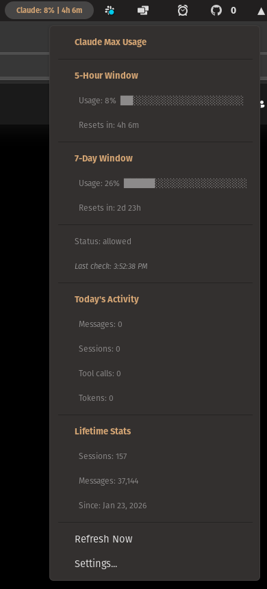

# Claude Usage Monitor - GNOME Shell Extension

A GNOME Shell extension that displays your Claude usage and rate limits directly in the top panel. Supports all Claude plans (Max, Pro, Free).



## Features

- **Panel indicator** showing plan name and usage percentage with reset countdown (Max)
- **5-hour and 7-day rate limit windows** with progress bars and reset timers (Max)
- **Today's activity** — messages, sessions, tool calls, and tokens used today
- **Lifetime stats** — total sessions, messages, and account age
- **Color-coded warnings** — green (<50%), orange (50–84%), red (85%+)
- **Login button** in settings to authenticate via Claude Code
- **Auto-refresh** on a configurable interval (default: 5 minutes)

## Requirements

- GNOME Shell 42, 43, or 44
- [Claude Code](https://docs.anthropic.com/en/docs/claude-code) installed and logged in
- An active Claude subscription (Max, Pro, or Free)

## Installation

### From source

```bash
git clone https://github.com/bitcoin-coder-bob/gnome-shell-extension-claude-usage.git
cd gnome-shell-extension-claude-usage
bash install.sh
```

Then restart GNOME Shell:
- **X11**: Press Alt+F2, type `r`, press Enter
- **Wayland**: Log out and back in

Enable the extension:
```bash
gnome-extensions enable claude-usage@bitcoin-coder-bob.github.io
```

## Authentication

This extension uses Claude Code's OAuth credentials. No API keys needed.

1. Open the extension settings and click **Log in with Claude Code**
2. Or run `claude` in any terminal to authenticate
3. The extension reads your token from `~/.claude/.credentials.json` automatically

## How it works

- **Max plans**: On each refresh, makes a minimal API call (~9 tokens via Haiku) to read rate limit headers from the Anthropic API. The panel indicator updates the reset countdown every 30 seconds between full refreshes.
- **Pro/Free plans**: Shows your plan name in the panel with daily activity and lifetime stats — no API calls made.
- Daily activity and lifetime stats are read from Claude Code's local `~/.claude/stats-cache.json` for all plans.

## Configuration

Open settings via the dropdown menu or:
```bash
gnome-extensions prefs claude-usage@bitcoin-coder-bob.github.io
```

- **Refresh Interval**: How often to check rate limits (60–3600 seconds, default 300)

## License

GPL-2.0-or-later
